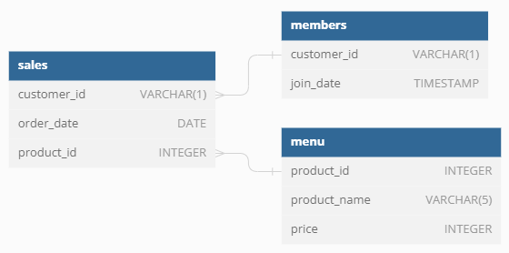

# Danny's Dinner - The Taste of Success

## Introduction
Danny's Dinner is a restaurant with a few months of operation. During this time, the restaurant has captured some basic data but don't know what to use it in their business strategies.

## The problem
Danny's Dinner wants to use their data to obtain some answers regarding his customers such as visit patterns, how much money they've spent and what are their favorites orders. By understanding better their customers, they will be able to provide a better and more personalized experience for their loyal customers.

Danny wants to use these insights as a guidance to the customer loyalty program.

He also needs help to generate basic datasets so his team can inspect the data withou using SQL.

## The data
Danny has provided a sample of his overall customer data and he hopes that this examples are enough to write SQL queries to help him answer the questions.

Here are the keys dataset Danny has shared with me:
- <code>sales</code>: captures all customer_id level purchases with an corresponding order_date and product_id information for when and what menu items were ordered.
- <code>menu</code>: maps the product_id to the actual product_name and price of each menu item.
- <code>members</code>: captures the join_date when a customer_id joined the beta version of the Danny’s Diner loyalty program.

  
Expand to see table schema.

### table 1: sales

### table 2: menu

### table 3: members

 
You can check the entity relationship on the following diagram:

## Case Study Questions
**1. What is the total amount each customer spent at the restaurant?**
~~~sql
SELECT s.customer_id, SUM(m.price)
FROM dannys_diner.sales AS s
INNER JOIN dannys_diner.menu AS m
USING (product_id)
GROUP BY s.customer_id
ORDER BY customer_id;
~~~

| customer_id | sum |
| ----------- | --- |
| A           | 76  |
| B           | 74  |
| C           | 36  |

---

**2. How many days has each customer visited the restaurant?**
~~~sql
SELECT customer_id, COUNT(order_date) AS days_visited
FROM dannys_diner.sales
GROUP BY customer_id
ORDER BY customer_id;
~~~

| customer_id | days_visited |
| ----------- | ------------ |
| A           | 6            |
| B           | 6            |
| C           | 3            |

---

**3. What was the first item from the menu purchased by each customer?**

~~~sql
SELECT customer_id, product_name AS FirstItem
FROM (
      SELECT s.customer_id, m.product_name,
      RANK() OVER(PARTITION BY m.product_name ORDER BY s.order_date) AS FirstOrder
      FROM dannys_diner.sales s
      INNER JOIN dannys_diner.menu m
      USING (product_id)
      ORDER BY s.customer_id) AS t
WHERE FirstOrder = 1
GROUP BY t.customer_id, t.product_name;
~~~

| customer_id | firstitem |
| ----------- | --------- |
| A           | curry     |
| A           | sushi     |
| B           | curry     |
| C           | ramen     |

The first items A ordered was a sushi and a curry. B ordered a curry and C ordered a ramen!

---

**4. What is the most purchased item on the menu and how many times was it purchased by all customers?**

~~~sql
SELECT m.product_name, COUNT(m.product_name) AS purchases
FROM dannys_diner.sales AS s
INNER JOIN dannys_diner.menu AS m
USING (product_id)
GROUP BY m.product_name
ORDER BY purchases DESC;
~~~

| product_name | purchases |
| ------------ | --------- |
| ramen        | 8         |
| curry        | 4         |
| sushi        | 3         |

Ramen is the most purchased item. It was ordered 8 times.

---

**5. Which item was the most popular for each customer?**

~~~sql
SELECT customer_id, product_name AS favoriteitem
  FROM (
    SELECT s.customer_id, m.product_name,
    	RANK() OVER(PARTITION BY s.customer_id ORDER BY COUNT(s.order_date) DESC) as RankItem
    FROM dannys_diner.sales s
    INNER JOIN dannys_diner.menu m
    USING(product_id)
    GROUP BY s.customer_id, m.product_name) t
WHERE rankitem = 1;
~~~

| customer_id | favoriteitem |
| ----------- | ------------ |
| A           | ramen        |
| B           | ramen        |
| B           | curry        |
| B           | sushi        |
| C           | ramen        |

The most popular item for customers A and C is ramen. Customer B may not have a popular item, because all of the items were ordered twice.

---

**6. Which item was purchased first by the customer after they became a member?**

~~~sql
SELECT customer_id, JoinFirstOrder AS firstitem
FROM (
  SELECT s.customer_id, s.order_date, m2.join_date,
    CASE
      WHEN s.customer_id = 'A' AND s.order_date > m2.join_date THEN m1.product_name
      WHEN s.customer_id = 'B' AND s.order_date > m2.join_date THEN m1.product_name
    END AS JoinFirstOrder,
    RANK() OVER(PARTITION BY s.customer_id ORDER BY s.order_date) AS Rank
  FROM dannys_diner.sales as s
  INNER JOIN dannys_diner.menu as m1
  USING (product_id)
  INNER JOIN dannys_diner.members as m2
  USING (customer_id)) t
WHERE JoinFirstOrder IS NOT NULL and Rank=4
ORDER BY Rank;
~~~
| customer_id | firstitem |
| ----------- | --------- |
| A           | ramen     |
| B           | sushi     |

After joining the fidelity program, A's first order was ramen and B's first order was sushi.

---
