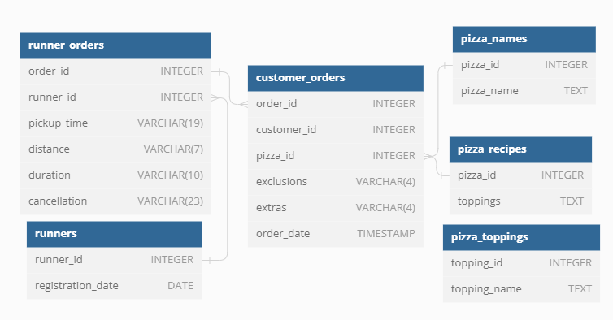

# Pizza Runner

## Introduction
After a fascinating discover while scrolling Instagram feed, Danny decided to start his Pizza Delivery service. He recruited 'runners' to deliver pizza from Danny's HQ to customers.

The customers could use Danny's mobile application to make an order.

This is Pizza Runner!

## The data
He has prepared for us an entity relationship diagram of his database design but requires further assistance to clean his data and apply some basic calculations so he can better direct his runners and optimise Pizza Runner’s operations.

Here are the keys dataset Danny has shared with me:
- Table 1: <code>runners</code>: shows the registration_date for each new runner.

- Table 2: <code>customer_orders</code>: captures the orders with 1 row for each individual pizza that is part of the order.
    - <b>pizza_id</b>: the type of pizza which was ordered.
    - <b>exclusions</b>: are the ingredient_id values which should be removed from the pizza
    - <b>extras</b>: are the ingredient_id values which need to be added to the pizza

- Table 3: <code>runner_orders</code>: captures the orders and to which runner the order was assigned.
    - <b>pickup_time</b>: timestamp at which the runner arrives at the Pizza Runner headquarters to pick up the freshly cooked pizzas.
    - <b>distance</b>: how far the runner had to travel to deliver the order to the respective customer.
    - <b>duration</b>: how long the runner had to travel to deliver the order to the respective customer.

- Table 4: <code>pizza_names</code>: Pizza Runner only has 2 pizzas available the Meat Lovers or Vegetarian.

- Table 5: <code>pizza_recipes</code>: Each pizza_id has a standard set of toppings which are used as part of the pizza recipe.

- Table 6: <code>pizza_toppings</code>: contains all of the topping_name values with their corresponding topping_id value.

  
Expand to see table schema.

### table 1: runners

### table 2: customer_orders

### table 3: runner_orders

### table 4: pizza_names

### table 5: pizza_recipes

### table 6: pizza_toppings

You can check the entity relationship on the following diagram:

## Case Study Questions
WIP.